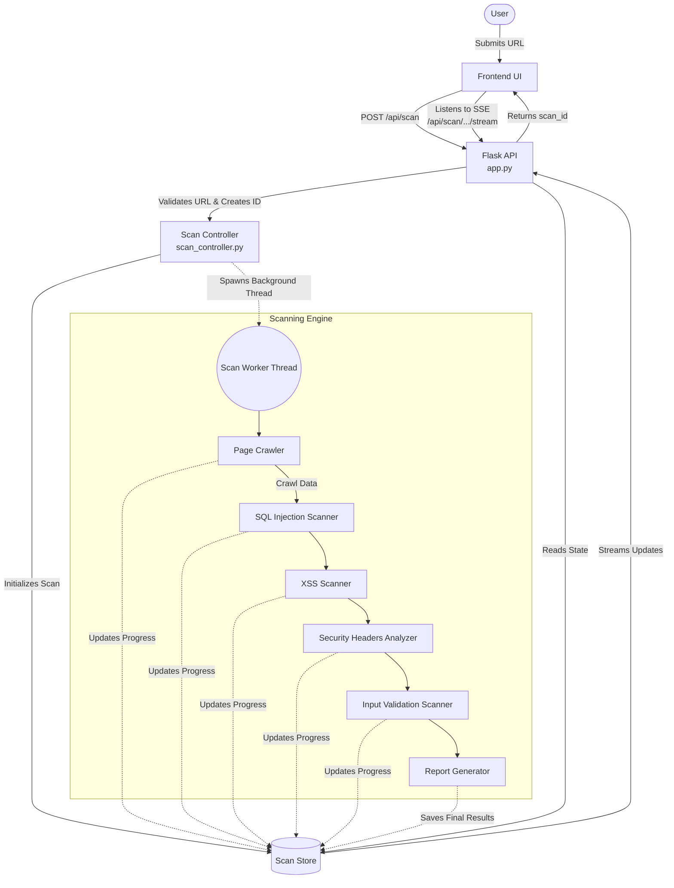
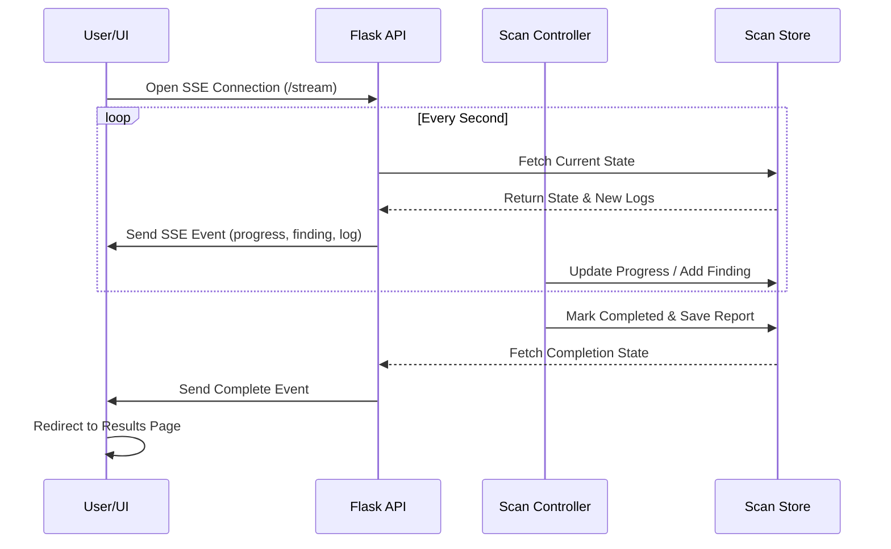

# ThreatTrace Architecture & Workflow

This document explains the internal workings of the **ThreatTrace** application. It details step-by-step what happens when a user submits a website domain for scanning, and how the various major components synchronize to produce a final security report.

---

## High-Level Architecture Flow

When a target website domain is added to the application, ThreatTrace orchestrates a coordinated effort between the client interface, a Flask web backend, a background scanning engine, and an in-memory or persisted state store.



---

## Step-by-Step Breakdown

### 1. Domain Submission & API Entry
- **Frontend Submission**: The user enters a URL into the web interface (`index.html` / `app.js`).
- **Flask API**: The `/api/scan` endpoint in `app.py` receives the request. It performs basic validation on the URL (checking format and reachability via a lightweight `HEAD` or `GET` request).
- **Initialization**: Once validated, the API generates a unique `scan_id`, initializes the scan via the `ScanController`, and responds immediately to the client with `201 Created`. This ensures the UI remains responsive and doesn't block while the heavy scanning occurs.

### 2. Background Scan Controller (`scan_controller.py`)
- **Isolation**: The `ScanController` kicks off the scanning process in a non-blocking daemon thread.
- **State Preparation**: It writes the initial "Queued" state into the `ScanStore`, setting up tracking for metrics like `requests_sent`, `payloads_tested`, and `vulnerabilities_found`.
- **Sequential Execution**: The worker thread executes the security modules one by one. It maintains strict timeout controls (`MAX_SCAN_TIME`) over each module to prevent the application from hanging indefinitely on slow or unresponsive target websites.

### 3. Synchronized Scanner Modules
The scanning engine breaks the workload into sequential modules. Each subsequent module relies on data gathered by the first.

```mermaid
classDiagram
    class ScanEngine {
        +Crawler()
        +SQLInjectionScanner()
        +XSSScanner()
        +HeaderScanner()
        +InputValidationScanner()
    }
    ScanEngine --> Crawler : Step 1: Discover
    ScanEngine --> SQLInjectionScanner : Step 2: Exploit DB
    ScanEngine --> XSSScanner : Step 3: Exploit Script
    ScanEngine --> HeaderScanner : Step 4: Analyze Config
    ScanEngine --> InputValidationScanner : Step 5: Fuzz inputs
```

1. **Page Crawler**: Crawls the target page to extract the HTML structure, identifying input forms, parameters, and headers. Output is passed to subsequent scanners.
2. **SQL Injection Scanner**: Tests identified inputs and URLs with SQL manipulation payloads to identify vulnerabilities.
3. **XSS Scanner**: Checks for Cross-Site Scripting (XSS) by attempting to reflect or execute malicious script payloads based on the crawled form fields.
4. **Security Headers Analyzer**: Reviews HTTP response headers to identify missing safety configurations (e.g., Clickjacking protections, strict transport security).
5. **Input Validation Scanner**: Validates whether the server properly sanitizes or rejects unexpected data.

### 4. Real-time Synchronization (Server-Sent Events)
A core feature of ThreatTrace is its ability to stream real-time results back to the user without needing constant page refreshes.


- **Callbacks**: Every scanner module is provided a `callback` function. Whenever a payload is tested or a vulnerability is found, the scanner invokes this callback.
- **Store Updates**: The callback immediately updates the `ScanStore` with the new log entries and metrics.
- **SSE Stream**: The client-side Javascript listens to an EventSource (`/api/scan/<scan_id>/stream`). The Flask API continuously yields the latest changes from the `ScanStore` until the status changes to `completed`, `failed`, or `timeout`.

### 5. Final Output & Report Generation
- Once all testing modules have finished (or the timeout window expires), the `ReportGenerator` compiles all findings (`HIGH`, `MEDIUM`, `LOW`, `INFO`).
- A final score is calculated based on the severity of the identified vulnerabilities.
- State is merged back into the `ScanStore`, making the final payload available via the `/api/scan/<scan_id>/results` endpoint.
- From the UI, the user can then view the results dashboard, or download structured summary reports (such as dynamically generated PDFs inside `app.py`).
